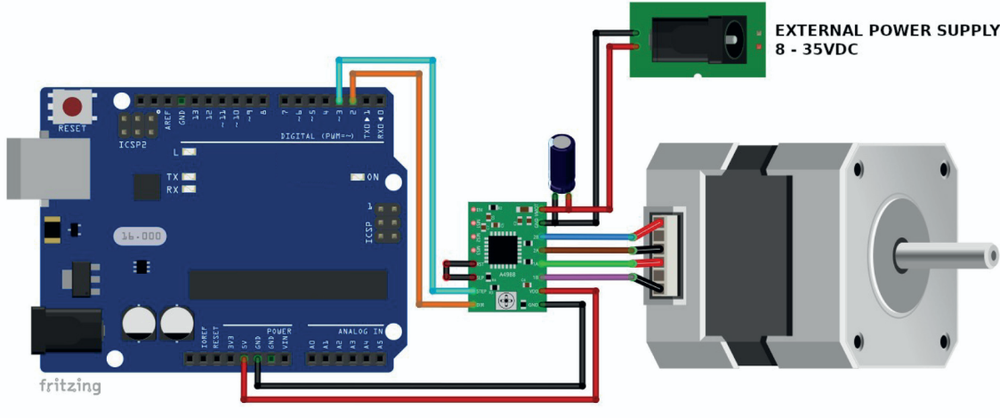

# ArduinoStepperMotor
This repo contains a basic interface to operate [RS Pro Stepper Motor 892-8732](https://docs.rs-online.com/d369/A700000008919642.pdf) from a PC using a Python script and an [Arduino board](https://www.arduino.cc/en/hardware/).
The motors are operated by a [A4988 Driver](https://www.az-delivery.de/en/products/a4988-schrittmotor-modul) (driver library can be downloaded from the website). 
## Connection diagram

**Note:** Additional wirings required for interlock and fine step control